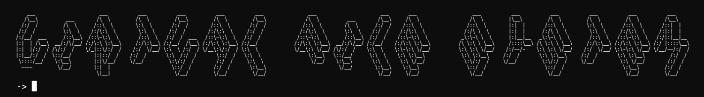
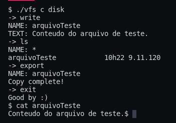

# Virtual File System

Um programa que permite criar um "sistem de arquivos virutal", que consiste em um arquivo, no qual pode-se armazenar e acessar outros arquivos. Este programa utiliza um formato de arquivo binário próprio, para dentro deste armazenar outros arquivos, como em um sistema de arquivos real. 


# Motivação

Este programa foi desenvolvido com fins educacionais, compreender utilização de arquivos binários com formatos próprios, e o funcionamento básico de um sistema de arquivos.


# Tecnologias

- C


# Screenshot




# Como Usar?

1. Com o arquivo `vfs.c` baixado e um compilador C instalado compile o programa, por exemplo com o `gcc` .

   ```
   $ gcc vfs.c -o vfs
   ```

2. Para criar um novo `sistema de arquivos virtual` basta executar o programa com o argumanto `c` (ou qualquer outro caractere) seguido do nome que será dado a ele, o comando criará um novo arquivo no diretório onde está sendo executado.

   ```
   $ ./vfs c [Nome do novo sistema de arquivos virtual]
   ```

3. Após isto o `CLI` do programa é iniciado onde outros seis comandos podem ser executados. Para executar um programa deve-se digitar seu nome sem nenhum argumento e precionar enter, como o comando `write` usado para escrever um novo arquivo.

   ```
   -> write
   NAME: [Nome do novo arquivo]
   TEXT: [Conteúdo do novo arquivo]
   ```

4. Outro comando é o `ls` usado para listar arquivos, podendo mostrar todos os arquivos (com `*`) ou um específico, retornando o nome de seus arquivos e suas respectivas datas e horas de criação.

   ```
   -> ls
   NAME: [Nome do arquivo a ser listado, caso queira ver todos use *]
   ```

5. O comando `cat` exibe o conteúdo de um arquivo.

   ```
   -> cat
   NAME: [Nome do arquivo a ter seu conteúdo exibido]
   ```

6. Com o comando `export` pode-se copiar um arquivo dentro do `sistema de arquivos virtual` para fora no diretório local.

   ```
   -> export
   NAME: [Nome do arquivo a ser exportado]
   ```

7. `exit` sai do programa.

   ```
   -> exit
   [Fim do programa]
   ```

8. Para abrir um `sistema de arquivos virtual` já existente basta usar o nome dele como primeiro argumento.

   ```
   $ ./vfs [Nome do sistema de arquivos virtual]
   ```

9. Por fim o último comando existente é o `import` que copia arquivos do diretório local.

   ```
   -> import
   NAME: [Nome do arquivo a ser importado]
   ```

   

# Exemplos

- ```
  $ ./vfs c disk.vfs
  -> write
  NAME: arquivoTeste
  TEXT: Conteúdo do arquivo teste.
  -> ls
  NAME: *
  arquivoTeste            10h22 9.11.120
  -> exit
  ```

- ```
  $ ./vfs disk.vfs
  -> export
  NAME: arquivoTeste
  Copy complete!
  -> exit
  
  $ cat arquivoTeste
  Conteúdo do arquivo teste.
  ```

- ```
  $ echo 'Conteúdo do arquivo externo.' > arquivoExterno
  $ ./vfs disk.vfs
  -> import
  NAME: arquivoExterno
  Copy complete!
  -> cat arquivoExterno
  Conteúdo do arquivo externo.
  ```

  

# Licença

MIT
